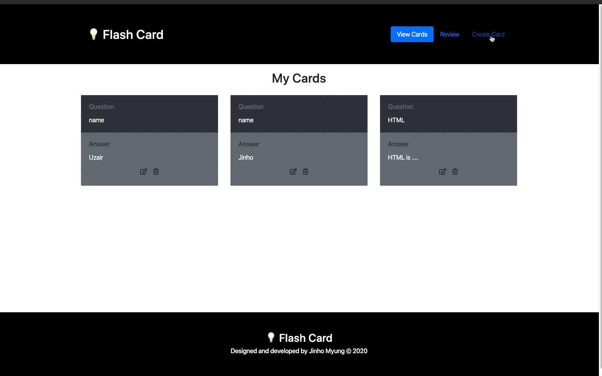
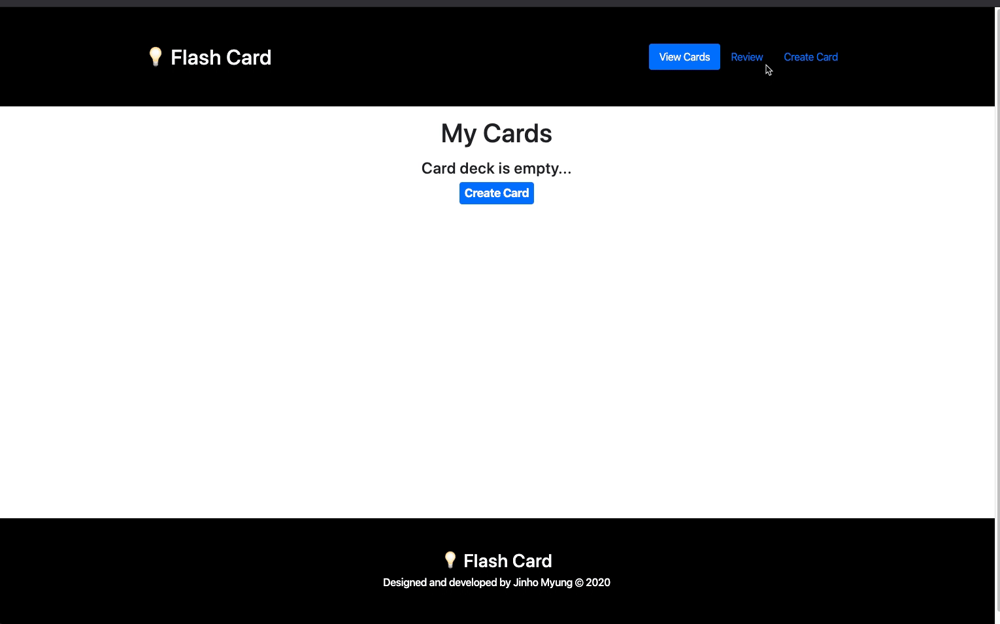

# flash-cards

## Description
A Dynamic Flash Card, responsive web App built with React.js

## Live Demo
Try the application live at [https://flash-card.jinho6225.com/](https://jinho6225.github.io/flashflash-card/)

## Technologies Used
- React.js
- Bootstrap 4
- CSS3
- Sass
- Browser's local storage
- AWS EC2

## Features
- User can view their current deck of flash cards
- User can create new flash cards
- User can delete their flash cards
- User can update their flash cards
- User can review their flash cards
- User can store their flash cards on the browser's local storage

## Preview




## Development

### System Requirements
- NPM 6 or higher

### Getting started
1. Clone the repository.
  ```shell
  git clone https://github.com/jinho6225/flash-card.git
  cd flash-cards
  ```
2. Install all dependencies with NPM.
  ```shell
  npm install
  ```
3. Start the project. You can view the application by opening http://localhost:3000 in your browser.
  ```shell
  npm run start
  ```
